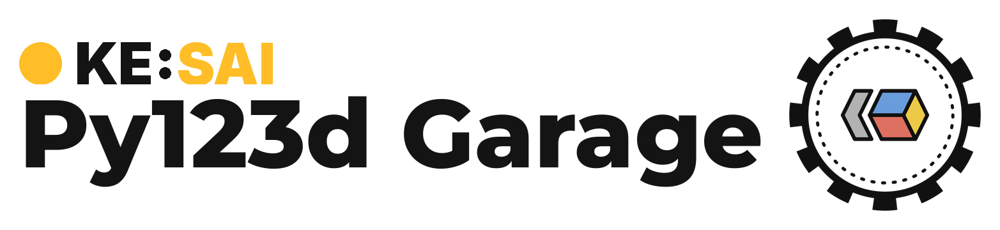

<div align="center">

<picture>
  <source media="(prefers-color-scheme: dark)" srcset="assets/logo_dark.png">
  
</picture>

</div>

<h1 align="center">Configuration System</h1>

We aim to keep our configuration system flexible while maintain some certain degree of type safety. While we support Hydra and its YAML systems, not all features of Hydra are available.

## Hydra restrictions and conventions

- Hydra does not check the YAML it composes. The schema in `src/py123d_garage/config/schema/` does: unknown keys and wrong types fail at startup.
- Hydra only composes YAML. A small plugin lets `training=` also take a `module:function` path to a Python preset.
- `${other_key}` interpolation is not allowed, only `${oc.env:VAR}`.
- `hydra.run.dir` is the output directory. A run saves its `config.yaml` there.
- No `_target_` and no `hydra.utils.instantiate`.

## Schema vs Preset

The schema in `src/py123d_garage/config/schema/` defines the structure of the configuration system.

The presets in `src/py123d_garage/config/presets/` are predefined for common setups, such as training a 3-camera latent TransFuser on nuPlan.

## Python vs YAML

Presets exist twice, as Python functions in [presets/python](../src/py123d_garage/config/presets/python) and as YAML files in [presets/yaml](../src/py123d_garage/config/presets/yaml).

As a convention of this repo, Python is the source of truth. A Python preset is a function returning the config dataclass, so the type checker catches mistakes and one preset can build on another with plain Python. The YAML files exist for Hydra.

At KE:SAI, the YAML files are generated, never edited by hand. After changing a Python preset, we regenerate them, and a unit test fails when they drift.

```bash
python -m py123d_garage.config.presets.export_yaml
```

Note that this is our personal workflow, not a requirement. If needed, edit the YAML directly, drop the unit tests if you want.

Both flavors can selected and edited the same way:

```bash
# a YAML preset
python -m py123d_garage.training.train training=tf_nuplan_trainval optimizer_config.learning_rate=1e-4

# a Python preset
python -m py123d_garage.training.train training=py123d_garage.config.presets.python.training.transfuser:tf_nuplan_trainval
```
